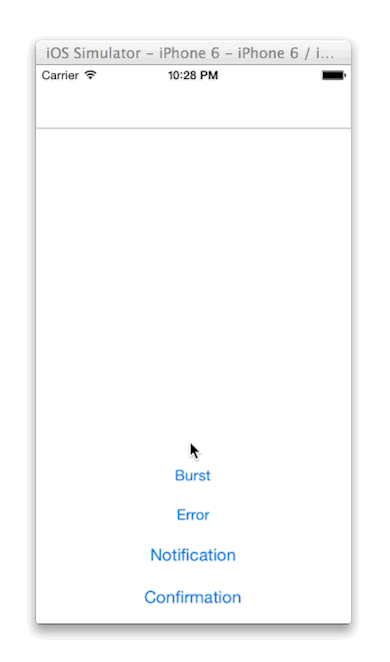

IIShortNotificationPresenter
============================

  

Presents short notifications over a view. Supports queuing and 3 presentation styles. Is highly flexible and configurable:

* can supply own queue, and comes with serial and concurrent queues out of the box
* can define own layouting (where to place notifications), comes with top layout and right side layout.
* can supply own notifications view. You can use the `IIShortNotificationDefaultView` as a base since it's pretty flexible.

## You can do stuff like this:

Top presentation (the default), great for iPhones:

Or side presentation (included), great for iPads (or larger iPhones):

Or you can create layouts yourself. It's **just** adding constraints. 

## License 

**IIShortNotificationPresenter** is published under the MIT License.

See [LICENSE](LICENSE) for the full license.